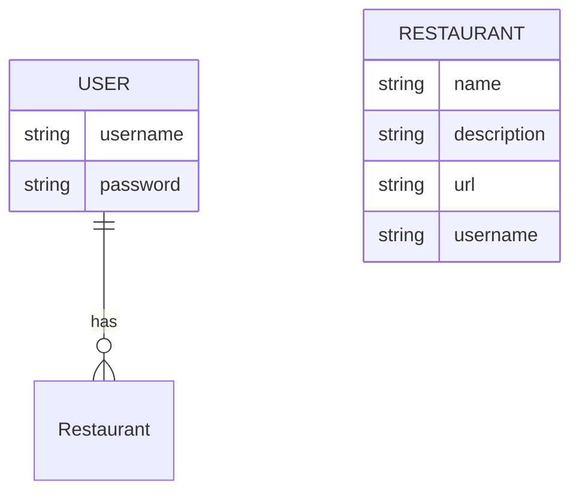

# Taste Tracker Backend
- **Description**: This is an API/Backend system using Django to store information that will allow the user to save any of their favorite restaurants. By using the name, description, and url of any restaurant any user can save their favorite restaurannts.
- **Technologies used**: Django, Python, CORS

### Models

### Backend Route Table
| Route Name |     URL    | HTTP Verb |        Description        |
|------------|------------|-----------|---------------------------|
|   Index    | /restaurant     |    GET    | Display list of restaurants    |
|   Show     | /restaurant/:id |    GET    | Shows a specific restaurant    |
|   Create   | /restaurant     |    POST   | Add new restaurant to database |
|   Update   | /restaurant/:id |    PUT    | Update a specific restaurant   |
|   Delete   | /restaurant/:id |   DELETE  | Delete a specific restaurant   |

### API
[Deployed Backend Link]()

### User Stories
- As a user, I can see a list of all the restaurants when I visit the page
- As a user, I can see detailed information about a specific restaurant
- As a user, I can create a new restaurant and add to the database
- As a user, I can update any specific restaurant if any information were to change
- As a user, I can delete any specific restaurant that I may need removed